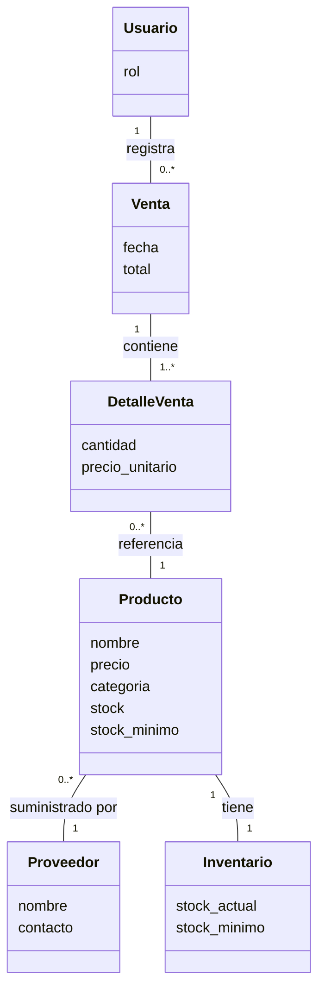

# Domain Map

> Estado: 🟢 Estable
> Última actualización: 2026-07-03
> Autor: Equipo ADSO | Equipo: Aprendices ADSO - SENA
> Fuente: Sintetizado a partir del SRS "Sistema de Gestión Supermercado La Esquina v1.0"

## Contexto

Mapa de las entidades principales del dominio del negocio "Supermercado La Esquina" y cómo se relacionan entre sí, con base en los requerimientos funcionales del SRS.

## Contenido

### Entidades identificadas
- **Usuario** (Administrador, Cajero, Supervisor)
- **Producto** (parte del Catálogo)
- **Proveedor**
- **Venta**
- **Detalle de Venta** (productos incluidos en una venta)
- **Inventario / Stock** (asociado a cada producto)

### Relaciones principales

Cada venta descuenta automáticamente el stock de los productos vendidos (RF-002), y cuando el stock de un producto llega a su mínimo configurado, el sistema notifica al administrador (RF-003).

## Referencias
- SRS v1.0, RF-001 a RF-004, RF-007, RF-010.
