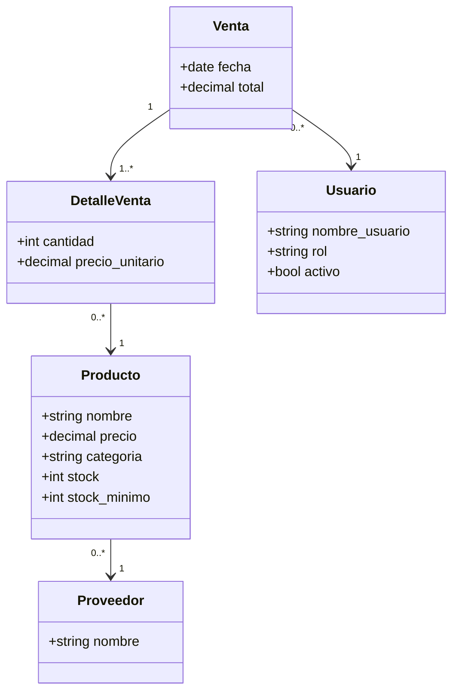

# Modelo de datos

> Estado: 🟡 En progreso
> Última actualización: 2026-07-03
> Autor: Equipo ADSO | Equipo: Aprendices ADSO - SENA
> Fuente: Sintetizado a partir del SRS "Sistema de Gestión Supermercado La Esquina v1.0" (atributos inferidos a partir de las descripciones de RF y tablas del SRS; no existe diccionario de datos formal en el documento fuente)

## Contexto

El SRS no incluye un modelo de datos formal ni tipos de dato específicos. Este documento infiere las entidades y sus atributos principales a partir de las descripciones de los requerimientos funcionales y de las tablas de casos de uso.

## Contenido

### Entidades y atributos inferidos

**Producto**
- nombre
- precio
- categoría
- stock actual
- stock mínimo
- proveedor (relación)

**Proveedor**
- nombre
- datos de contacto (no especificado en el SRS)

**Venta**
- fecha
- total
- usuario que la registró (relación con Usuario)

**Detalle de Venta**
- producto (relación)
- cantidad
- precio unitario al momento de la venta

**Usuario**
- nombre de usuario
- contraseña (almacenada de forma segura)
- rol (administrador, cajero, supervisor)
- estado (activo/inactivo)

### Diagrama de clases (síntesis)

## Referencias
- SRS v1.0, secciones 3.2, 4 (RF-001, RF-002, RF-004, RF-007) y sección 6.
