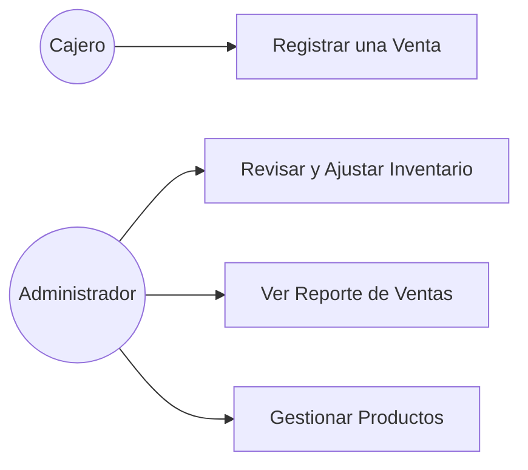

# Índice de diagramas

> Estado: 🟢 Estable
> Última actualización: 2026-07-03
> Autor: Equipo ADSO | Equipo: Aprendices ADSO - SENA
> Fuente: Sintetizado a partir del SRS "Sistema de Gestión Supermercado La Esquina v1.0"

## Contexto

El SRS define 4 casos de uso principales (sección 6). A partir de ellos se construye el diagrama de casos de uso del sistema.

## Contenido

### Actores
- **Cajero** (Martha o Julián)
- **Administrador** (Don Carlos)

### Casos de uso
- CU-001: Registrar una Venta (Cajero)
- CU-002: Revisar y Ajustar Inventario (Administrador)
- CU-003: Ver Reporte de Ventas (Administrador)
- CU-004: Gestionar Productos (Administrador)

### Diagrama de casos de uso (síntesis)

### Detalle de cada caso de uso

**CU-001: Registrar una Venta**
| Campo | Descripción |
|---|---|
| Actor | Cajero (Martha o Julián) |
| Precondición | El cajero debe estar autenticado. Los productos deben estar en el catálogo con precios. |
| Flujo principal | 1. Cajero busca un producto por nombre o código. 2. El sistema muestra el precio. 3. El cajero agrega el producto a la venta. 4. Repite para todos los productos. 5. El sistema calcula el total. 6. Cajero confirma el pago. 7. El sistema guarda la venta y descuenta el inventario. 8. Se genera el recibo. |
| Flujo alternativo | Si un producto no existe en el catálogo, el sistema muestra un mensaje de error y no lo agrega. |
| Postcondición | La venta queda registrada y el inventario se actualiza automáticamente. |

**CU-002: Revisar y Ajustar Inventario**
| Campo | Descripción |
|---|---|
| Actor | Administrador (Don Carlos) |
| Precondición | El administrador debe estar autenticado. |
| Flujo principal | 1. Ingresa al módulo de inventario. 2. Consulta el listado de productos con stock actual. 3. Identifica productos con stock bajo. 4. Selecciona el producto a ajustar. 5. Ingresa la nueva cantidad. 6. El sistema guarda el cambio. |
| Flujo alternativo | Si el stock ya llegó al mínimo, el sistema muestra una alerta antes de que el admin entre al módulo. |
| Postcondición | El inventario queda actualizado con la cantidad correcta. |

**CU-003: Ver Reporte de Ventas**
| Campo | Descripción |
|---|---|
| Actor | Administrador (Don Carlos) |
| Precondición | Haber registrado al menos una venta en el sistema. |
| Flujo principal | 1. Ingresa al módulo de reportes. 2. Selecciona el periodo (día, semana, mes). 3. El sistema genera el reporte con: total de ventas, número de transacciones y productos más vendidos. 4. El admin puede exportar el reporte si lo necesita. |
| Flujo alternativo | Si no hay ventas en el periodo seleccionado, el sistema muestra un mensaje indicándolo. |
| Postcondición | El administrador obtiene información real del negocio para tomar decisiones. |

**CU-004: Gestionar Productos**
| Campo | Descripción |
|---|---|
| Actor | Administrador (Don Carlos) |
| Precondición | Estar autenticado como administrador. |
| Flujo principal | 1. Ingresa al catálogo de productos. 2. Selecciona si quiere agregar, editar o eliminar. 3. Llena el formulario con: nombre, precio, categoría, stock actual, stock mínimo y proveedor. 4. Guarda los cambios. 5. El sistema confirma la operación. |
| Flujo alternativo | Si intenta eliminar un producto que tiene ventas registradas, el sistema lo bloquea para no perder el historial. |
| Postcondición | El catálogo queda actualizado y listo para ser usado en el módulo de ventas. |

## Referencias
- SRS v1.0, sección 6.
